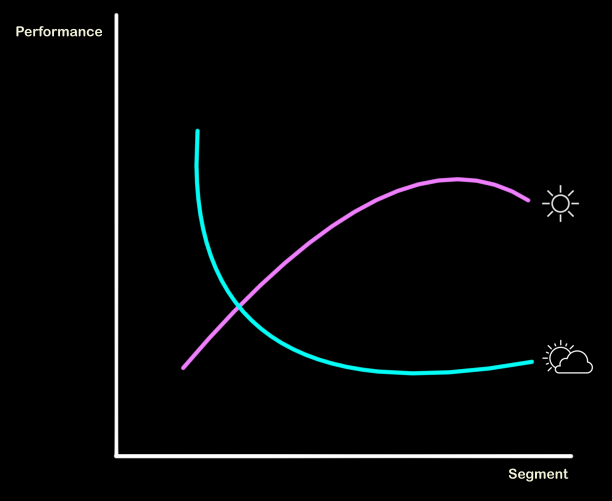

# Project: (How) does "the weather" affect Ride performance
The aim of the project is to figure out if, and how, "the weather" (i.e. climate data in the likes of humidity, precipation, temperature, ...) affects the stats recorded on strava.

## Data
### Sources of the "raw" data
* Historical Weatherdata from Germany (based on DWD API): https://brightsky.dev
* Ride statistics: https://www.strava.com/api/v3/athletes/{athleteID}
### Structure of the preprocessed (aka "wrangled") data
* 
## Methodology
Here you can find all of my projects related to my DataScience endeavour
## Expected results
Here you can find all of my trials and errors on my way to understand the (DataScience-)relevant TechStack
