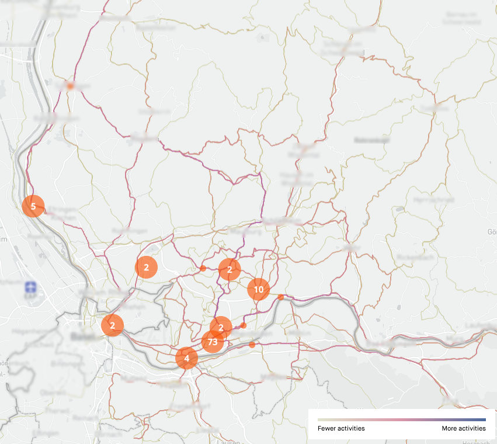

# Project: (How) does "the weather" affect Ride performance
The aim of the project is to figure out if, and how, "the weather" (i.e. climate data in the likes of humidity, precipation, temperature, ...) affects the stats recorded on strava.

## Data
To allow for comparison of different rides, segments have to be found that are ridden quite often. A side contraint that arises from the choosen weather-API limits the rides in question to germany only (DWD-weaterdata). For an initial overview the Strava heatmap helps a lot (https://www.strava.com/athlete/heatmaps):

The idea is to pic rides that have a high overlap in segments
### Sources of the "raw" data
* Historical Weatherdata from Germany (based on DWD API): https://brightsky.dev
* Ride statistics: https://www.strava.com/api/v3/athletes/{athleteID}
### Structure of the preprocessed (aka "wrangled") data
* 
## Methodology
* Statics:
  * Test wheter ride data is statistically relevant (i.e.: carries the desired information and is representative)
## Results

